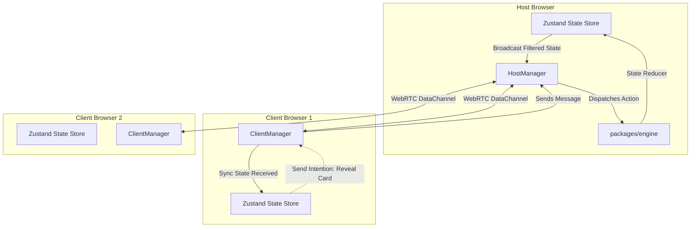

# Krypton — Multiplayer Word Deduction Game (P2P)

**Krypton** é um jogo de dedução de palavras multiplayer em tempo real inspirado no clássico *Codenames*. O grande diferencial do projeto é sua arquitetura **Host-Authoritative P2P (Peer-to-Peer) via WebRTC**, rodando inteiramente no navegador e **sem a necessidade de um servidor de banco de dados ou backend dedicado**.

---

## 🏗️ Arquitetura do Sistema

O Krypton adota o modelo **Host-Authoritative P2P**, onde um dos navegadores assume o papel de servidor autoritativo (Host) e os demais atuam como clientes finos.



### Por que Host-Authoritative?
1. **Segurança contra Trapaças**: O tabuleiro possui 25 cartas com cores secretas (Vermelho, Azul, Neutro e Assassino). Apenas o **Mestre (Spymaster)** de cada time pode conhecer o mapa dessas cores. Em uma arquitetura P2P comum, enviar todo o mapa para todos os clientes facilitaria trapaças (bastaria inspecionar a memória do browser).
2. **Filtragem de Transmissão (State Masking)**: O Host mantém o estado completo real do jogo. Ao sincronizar o estado com os clientes (`SYNC_STATE`), o `HostManager` inspeciona o papel do jogador destinatário. Se o destinatário for um **Operativo** ou **Espectador**, o Host remove as cores das cartas não reveladas (`color = null`) antes do envio.
3. **Validação Centralizada**: Toda e qualquer jogada (ex: adivinhar palavra, enviar pista) é enviada ao Host como uma **intenção de jogada**. O Host valida as condições através de regras puras na `engine` antes de alterar o estado oficial e replicar a nova versão aos clientes.

---

## 🛠️ Pilha de Tecnologias e Justificativas

A escolha de ferramentas buscou priorizar **desempenho local, baixo custo de infraestrutura (servidores gratuitos de deploy) e forte segurança de tipos**.

| Tecnologia | Função no Projeto | Motivo da Escolha |
|---|---|---|
| **TypeScript (Strict)** | Linguagem base | Garante contratos rígidos de tipos entre o motor de regras, a rede WebRTC e a interface de UI, mitigando bugs de tempo de execução. |
| **pnpm Workspaces** | Gerenciador de Monorepo | Permite particionar o projeto em módulos independentes (`web`, `engine`, `network`, `shared`) sem complicar o link de pacotes no desenvolvimento. |
| **React + Vite** | SPA Framework & Bundler | Vite fornece compilação extremamente rápida via ESM nativo em desenvolvimento. React oferece reatividade declarativa de UI adequada para jogos de tabuleiro virtuais. |
| **Tailwind CSS v4** | Estilização | Estilização por utilitários de alta performance baseada nos novos recursos do CSS nativo, oferecendo carregamento rápido e flexibilidade total de design escuro. |
| **shadcn/ui** | Componentes Visuais | Fornece componentes de interface acessíveis e altamente customizáveis (como Buttons e Cards) que não poluem o bundle final. |
| **Zustand** | Gerenciador de Estado | Extremamente leve, simples e rápido. Permite sincronizar facilmente os callbacks da camada de rede WebRTC com o renderizador de UI do React sem o boilerplate do Redux. |
| **PeerJS** | Wrapper de WebRTC | Simplifica a conexão inicial (signaling) e a criação de canais de dados bi-direcionais confiáveis (`reliable: true`) usando um servidor gratuito de coordenação de salas. |
| **Vitest** | Testes Unitários | Execução ultra veloz de testes unitários para a `engine` do jogo de forma isolada do DOM ou da rede. |

---

## 📂 Estrutura do Monorepo

O projeto está dividido em pacotes com responsabilidades bem isoladas (regras rígidas de importação):

```
krypton/
├── apps/
│   └── web/            # Interface em React. Depende de engine, network e shared.
└── packages/
    ├── engine/         # Lógica pura do jogo (zero dependência de UI e rede). Totalmente testável.
    ├── network/        # Abstração de WebRTC, gerência de salas e Host/Client. Depende de engine e shared.
    └── shared/         # Tipos e estruturas de dados comuns (zero dependência de terceiros).
```

### Regras de Ouro de Importação
* **`engine`** e **`shared`** são **zero-dependency**. Nunca importe React, Tailwind, PeerJS ou elementos de rede dentro desses pacotes. Eles servem de motor puro e devem rodar em qualquer ambiente (inclusive Node.js puro para servidores futuros).

---

## 🎮 Fluxo de Funcionamento da Partida

### 1. Criação do Lobby
* O Host escolhe um apelido e clica em **Criar Sala**.
* A camada de rede abre um Peer no PeerJS Cloud com o ID `krypton-{ROOM_CODE}` (onde o código é gerado de forma legível sem letras ambíguas, ex: `H9K2LP`).
* Outros jogadores digitam seus apelidos e o código de 6 caracteres para se conectarem de forma direta (P2P DataChannel).

### 2. Divisão de Equipes
* Todos os jogadores acessam a tela de seleção de equipes.
* O Host pode redistribuir as pessoas aleatoriamente ou os próprios usuários clicam em **Time Vermelho**, **Time Azul** ou **Espectador**.
* Cada equipe ativa precisa selecionar exatamente **1 Mestre (Spymaster)** e no mínimo **1 Operativo (Operative)**.
* O Host clica em **Iniciar Partida** assim que as equipes estiverem válidas.

### 3. Geração do Tabuleiro
* O Host gera 25 palavras únicas em português tiradas de uma lista de mais de 400 termos do dicionário interno do jogo.
* As cores são embaralhadas e atribuídas: **9 da equipe inicial**, **8 da equipe adversária**, **7 neutras** e **1 assassina** (preta).
* O Host inicia o primeiro turno definindo a equipe inicial.

### 4. Ciclo de Turnos e Regras
* **Dando Pista (Spymaster)**: O Mestre do time ativo digita uma dica (única palavra) e uma quantidade de cartas associadas.
* **Adivinhando (Operativos)**: Os Operativos do time ativo veem a pista e clicam nas cartas.
  * *Carta Correta*: O time ganha o ponto e pode continuar adivinhando (limite de palpites = pista + 1).
  * *Carta Neutra ou Inimiga*: O turno encerra-se automaticamente e passa para a equipe rival.
  * *Assassino*: Fim de jogo imediato com derrota do time ativo.
* **Jogar Novamente**: Ao final da partida, o Host pode clicar em "Jogar Novamente". Isso redefine o tabuleiro mas mantém todos conectados na mesma sala, poupando a necessidade de reinserção de dados.

---

## 🚀 Como Executar e Implantar

Consulte o arquivo [GUIDE.md](GUIDE.md) para instruções detalhadas de como instalar dependências, rodar testes locais, realizar builds de produção e implantar a aplicação de forma gratuita no **Cloudflare Pages**.
