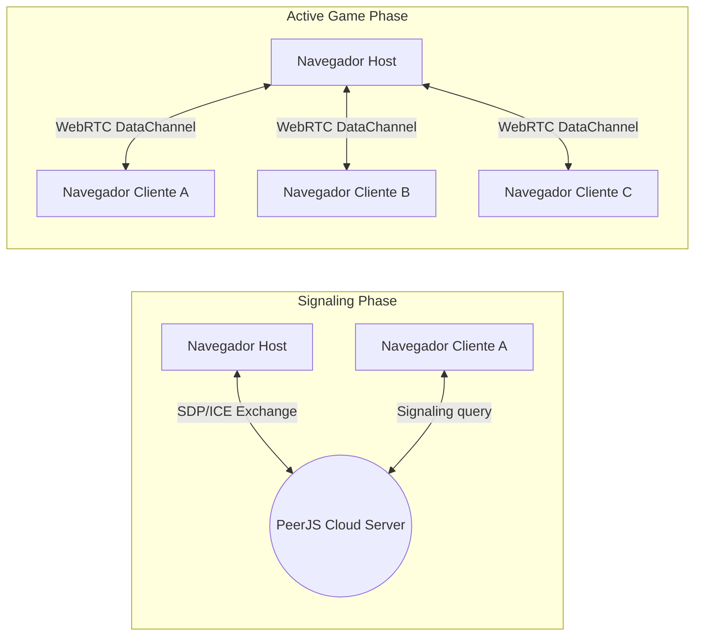

# Comunicação e Conectividade

## 1. Objetivo
Descrever o protocolo de conectividade P2P via WebRTC, o papel do servidor de sinalização (signaling) e a topologia de conexões de rede formada pelos navegadores durante a partida.

---

## 2. Conceitos
* **WebRTC (Web Real-Time Communication)**: Tecnologia que viabiliza áudio, vídeo e transmissão de dados genéricos diretamente entre navegadores.
* **Signaling Server (Sinalização)**: Servidor intermediário encarregado apenas de ajudar as pontas a descobrirem uma à outra na internet (troca de IPs públicos, portas e metadados SDP). Não participa da lógica de jogo.
* **Topologia Estrela (Star Topology)**: Topologia onde todas as conexões partem ou chegam a um nó central (neste caso, o Host).

---

## 3. Funcionamento
* **Sinalização inicial**: O Host registra-se no PeerJS Cloud informando seu código de sala (gerando o peer ID `krypton-{CÓDIGO}`).
* **Handshake**: Quando um cliente tenta entrar na sala, ele pergunta ao PeerJS Cloud pelo Host. O PeerJS estabelece o canal de sinalização e os navegadores negociam a conexão direta WebRTC. Uma vez aberta, a conexão com o servidor de sinalização não é mais necessária para o fluxo de jogo.
* **Canais de dados**: A conexão WebRTC abre um `RTCDataChannel` confiável (`reliable: true`) para tráfego de dados JSON serializados.

---

## 4. Diagrama de Topologia de Rede



---

## 5. Exemplos

### Inicialização da conexão de rede
Trecho simplificado de como o cliente conecta-se ao host na nossa camada de rede (`packages/network`):
```typescript
const conn = peer.connect(`krypton-${roomCode}`, {
  reliable: true,
  serialization: 'json',
});
```

---

## 6. Referências
* [MDN Web Docs - WebRTC API](https://developer.mozilla.org/en-US/docs/Web/API/WebRTC_API)
* [PeerJS connection guidelines](https://peerjs.com/docs/)
