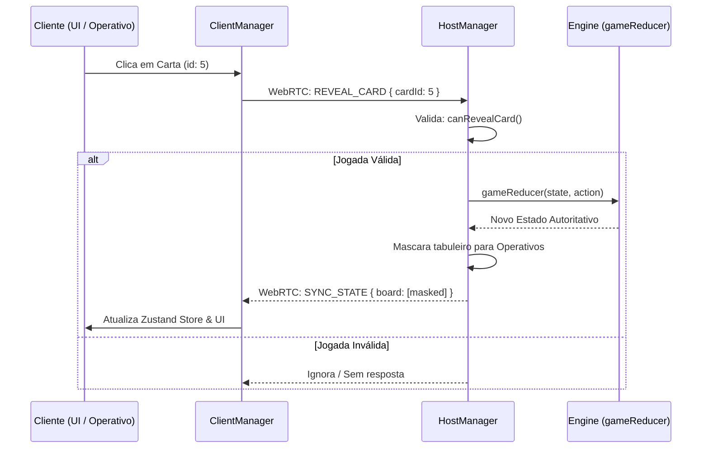

# Fluxo de Dados

## 1. Objetivo
Explicar a jornada que os dados de estado e as intenções de ação percorrem pela aplicação, conectando a interação visual na interface React com o processamento central da engine.

---

## 2. Conceitos
* **Ação Unidirecional**: O fluxo de dados do Krypton é unidirecional e circular. O estado local do cliente é uma representação passiva, atualizado apenas quando recebe dados validados do Host.
* **Intenção de Ação (Intention)**: Mensagens WebRTC enviadas por clientes requisitando alterações (ex: `REVEAL_CARD`).

---

## 3. Funcionamento
O ciclo do fluxo de dados opera da seguinte forma:
1. O usuário interage com a tela (ex: clica em uma carta para revelá-la).
2. O `ClientManager` intercepta o clique e empacota-o em uma mensagem WebRTC.
3. O Host recebe a mensagem, identifica o remetente e executa os validadores lógicos (ex: `canRevealCard()`).
4. Se válido, o Host alimenta a ação no `gameReducer()`.
5. O novo estado resultante é gerado no Host.
6. O Host filtra os dados confidenciais e transmite o novo estado formatado para todos os clientes.
7. O Zustand store dos clientes é atualizado, re-renderizando a interface.

---

## 4. Diagrama de Fluxo de Dados



---

## 5. Exemplos

### Execução de Ação no Zustand Store
Os clientes ouvem o callback `stateUpdated` emitido pelo `ClientManager` e atualizam a store de forma reativa:
```typescript
client.on('stateUpdated', (state) => {
  useGameStore.getState().setGameState(state);
});
```

---

## 6. Referências
* [Flux Architecture Overview](https://facebookarchive.github.io/flux/docs/in-depth-overview)
* [Zustand state creator documentation](https://zustand.docs.pmnd.rs/getting-started/introduction)
