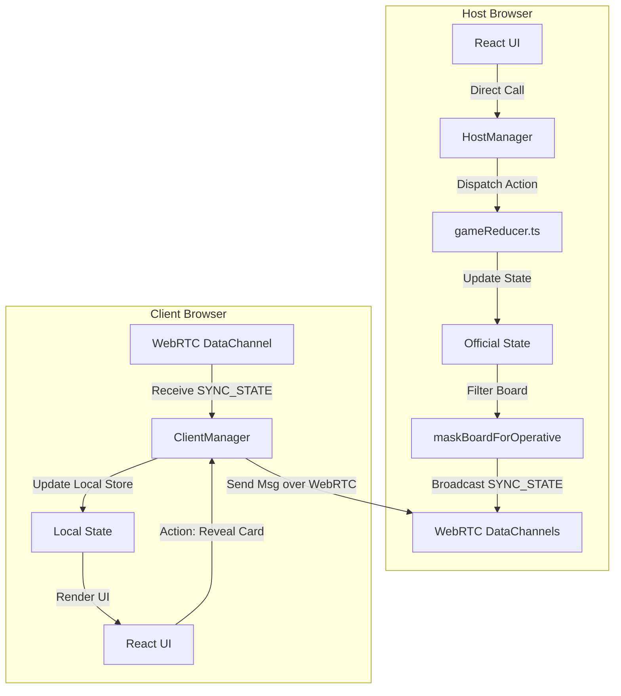

# Visão Geral da Arquitetura

## 1. Objetivo
Explicar a arquitetura lógica do Krypton baseada no modelo **Host-Authoritative P2P (Peer-to-Peer)**, detalhando o porquê desta decisão e como ela protege as regras de negócio.

---

## 2. Conceitos
* **P2P (Peer-to-Peer)**: Comunicação direta entre navegadores sem servidores intermediários.
* **Host-Authoritative**: Modelo onde apenas uma das pontas conectadas (o Host que cria a sala) tem o poder oficial de alterar o estado do jogo. Os clientes apenas enviam comandos/intenções.
* **State Masking (Mascaramento)**: Filtragem de campos sensíveis para evitar trapaça.

---

## 3. Funcionamento
* Quando o jogo começa, o Host gera o tabuleiro oficial contendo todas as cores das cartas (Vermelho, Azul, Neutro e Assassino).
* O Host armazena esse estado completo.
* Os clientes (jogadores que entram na sala) estabelecem conexões WebRTC diretas com o Host.
* O Host envia atualizações de estado parciais aos clientes. Se o cliente for um **Operativo**, o Host esconde as cores de todas as cartas não reveladas, garantindo que os clientes nunca recebam informações sigilosas.

---

## 4. Diagrama Arquitetural de Componentes e Fluxo



---

## 5. Exemplos

### Exemplo de Mascaramento do Tabuleiro
O Host possui a carta da posição 0 como `'red'`. O Operativo tenta inspecionar a carta não revelada. No payload recebido pelo Operativo, a propriedade `color` estará preenchida como `null`:

```json
// Estado real no Host:
{ "id": 0, "word": "SOL", "color": "red", "revealed": false }

// Estado enviado aos Operativos (mascarado):
{ "id": 0, "word": "SOL", "color": null, "revealed": false }
```

---

## 6. Referências
* [Multiplayer Game Architecture - Authoritative Servers](https://www.gabrielgambetta.com/client-server-game-architecture.html)
* [PeerJS Cloud API Reference](https://peerjs.com/)
