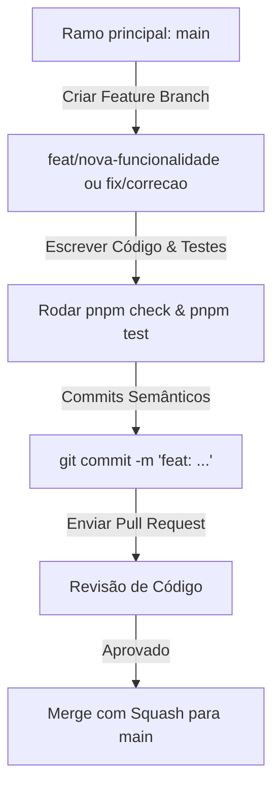

# Guia de Contribuição

## 1. Objetivo
Definir os padrões lógicos e de fluxo de trabalho exigidos dos colaboradores e desenvolvedores que queiram propor melhorias ou correções para o projeto Krypton.

---

## 2. Conceitos
* **Git Flow**: Modelo de ramificação de ramos (branching model) com foco na estabilidade do ramo principal.
* **Semantic Commits**: Mensagens de commit padronizadas (baseadas em Conventional Commits) para manter o histórico claro e facilitar a geração automática de changelogs.

---

## 3. Padrão de Trabalho e Fluxo



---

## 4. Padrões de Nomenclatura

### Ramificações (Branches)
* **Funcionalidades**: `feat/nome-da-funcionalidade`
* **Correções**: `fix/nome-do-bug`
* **Melhorias de Performance**: `perf/o-que-melhorou`
* **Documentação**: `docs/assunto`

### Mensagens de Commit (Conventional Commits)
* `feat(web): adicionar placar interativo`
* `fix(engine): corrigir estouro de palpites no reducer`
* `docs: atualizar guia de deploy do cloudflare`
* `chore: atualizar pacotes e dependências`

---

## 5. Exemplos

### Submeter uma Correção de Código
```bash
# 1. Crie uma branch a partir da main atualizada
git checkout -b fix/correct-timer-leak

# 2. Faça as correções e valide
pnpm check
pnpm test

# 3. Comite com mensagem semântica
git commit -m "fix(network): prevent peer listener leak on unmount"

# 4. Envie e abra o Pull Request no GitHub
git push origin fix/correct-timer-leak
```

---

## 6. Referências
* [Conventional Commits Specification](https://www.conventionalcommits.org/en/v1.0.0/)
* [Git Flow Branching Model](https://nvie.com/posts/a-successful-git-branching-model/)
