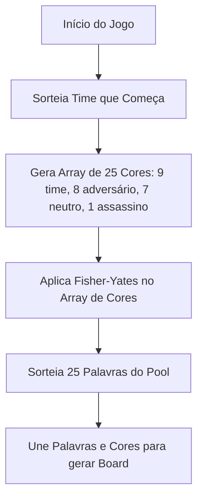

# Tabuleiro (Board) e Distribuição de Cartas

## 1. Objetivo
Explicar o processo de inicialização do tabuleiro do jogo, incluindo a seleção de palavras da lista oficial, a distribuição de cores das cartas e o algoritmo de embaralhamento seguro.

---

## 2. Conceitos
* **Board Grid**: Uma coleção linear indexada de 25 elementos representando a matriz 5×5 exposta na interface do jogo.
* **Fisher-Yates Shuffle**: Algoritmo matemático para embaralhamento de arrays de forma imparcial (com complexidade linear $O(n)$).

---

## 3. Funcionamento
Quando o Host inicia o jogo:
1. Um time de saída é selecionado aleatoriamente (`red` ou `blue`).
2. É construído um vetor contendo a distribuição exata de 25 cores:
   * **9 cartas** para a equipe inicial.
   * **8 cartas** para a equipe adversária.
   * **7 cartas** neutras.
   * **1 carta** assassina (preta).
3. O algoritmo **Fisher-Yates** embaralha as cores.
4. São sorteadas **25 palavras exclusivas** a partir de uma pool de mais de 400 palavras (`wordList.ts`).
5. As cartas são instanciadas contendo ID, palavra, cor atribuída e estado de revelação (`revealed: false`).

---

## 4. Diagrama de Geração do Tabuleiro



---

## 5. Exemplos

### Implementação do Fisher-Yates (boardGenerator.ts)
```typescript
function shuffle<T>(arr: T[]): T[] {
  for (let i = arr.length - 1; i > 0; i--) {
    const j = Math.floor(Math.random() * (i + 1));
    const tmp = arr[i]!;
    arr[i] = arr[j]!;
    arr[j] = tmp;
  }
  return arr;
}
```

---

## 6. Referências
* [Módulo de Geração de Tabuleiro](file:///home/ikidon/github/krypton/packages/engine/src/boardGenerator.ts)
* [Fisher-Yates Shuffle Algorithm - Wikipedia](https://en.wikipedia.org/wiki/Fisher%E2%80%93Yates_shuffle)
