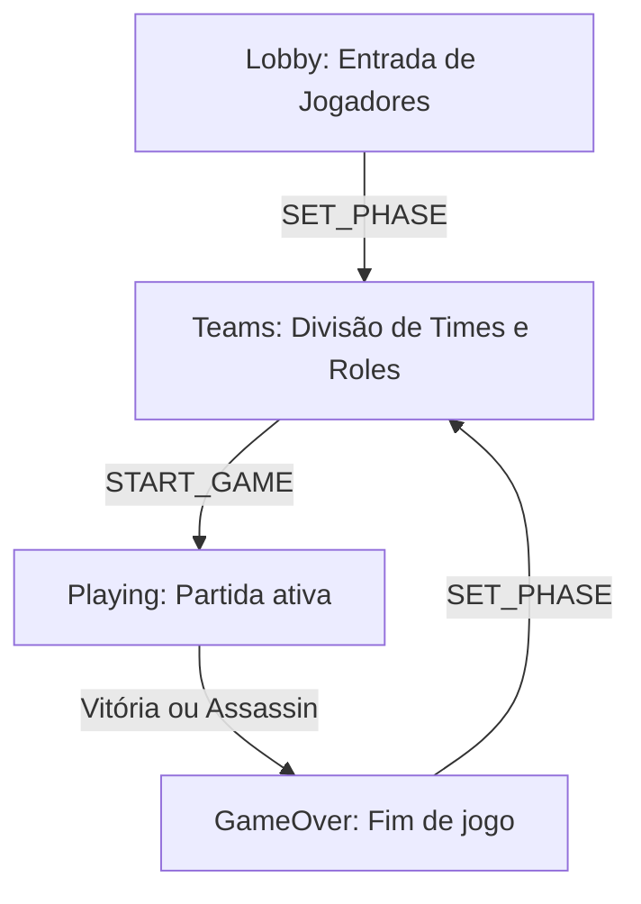

# GameState

## 1. Objetivo
Documentar o objeto central de estado do jogo (`GameState`), suas propriedades, responsabilidade de replicação e ciclo de vida das fases da partida.

---

## 2. Conceitos
* **Fonte da Verdade**: O `GameState` é o modelo de dados compartilhado. Qualquer alteração deve seguir a estrutura rígida definida no pacote `shared`.
* **Fases (GamePhases)**: Representam a etapa global em que o jogo se encontra (`lobby`, `teams`, `playing`, `gameover`).

---

## 3. Funcionamento
O ciclo de vida do jogo é representado por transições ordenadas do estado:



O Host mantém o `GameState` oficial e o propaga após mascaramento do tabuleiro (`maskBoardForOperative()`).

---

## 4. Estrutura do Estado (TypeScript)
O estado é definido em `packages/shared/src/game.ts`:

```typescript
export interface GameState {
  phase: 'lobby' | 'teams' | 'playing' | 'gameover';
  board: Board;
  players: Player[];
  currentTeam: 'red' | 'blue';
  turnPhase: 'giving_clue' | 'guessing' | 'end_turn';
  clue: Clue | null;
  guessesLeft: number;
  remainingCards: { red: number; blue: number };
  scores: { red: number; blue: number };
  winner: 'red' | 'blue' | null;
  endReason: 'cards' | 'assassin' | null;
}
```

---

## 5. Exemplos

### Inicialização do Estado
Ao criar uma sala, o estado inicial é bootstrapado:
```typescript
import { createInitialGameState } from '@krypton/shared';
const state = createInitialGameState();
```

---

## 6. Referências
* [Modelo de Tipagem no packages/shared/src/game.ts](file:///home/ikidon/github/krypton/packages/shared/src/game.ts)
