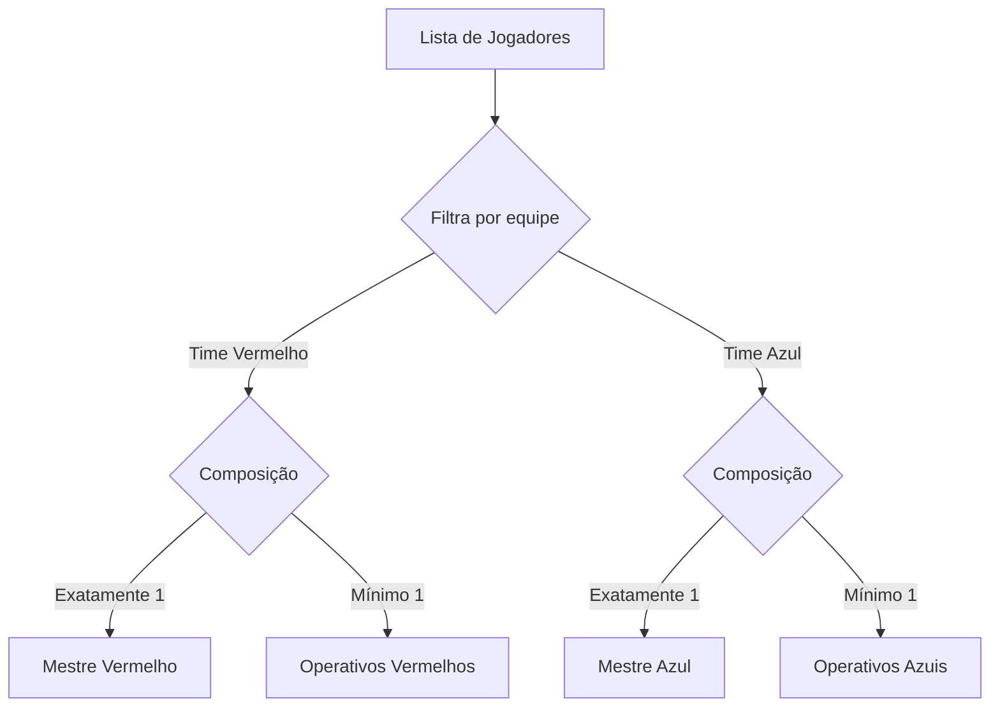

# Equipes e Papéis (Teams & Roles)

## 1. Objetivo
Explicar a divisão de jogadores em equipes, a atribuição de papéis, as restrições mínimas para o início da partida e o funcionamento do algoritmo de atribuição randômica.

---

## 2. Conceitos
* **Red / Blue Teams**: Os dois times competidores ativos.
* **Spectator**: Jogador passivo que não influencia o fluxo da partida, apenas acompanha as jogadas.
* **Spymaster (Mestre)**: O jogador que conhece as cores secretas e fornece as dicas. Deve haver exatamente 1 por time.
* **Operative (Operativo)**: O jogador que vê apenas as palavras e as escolhe com base nas dicas. Deve haver pelo menos 1 por time.

---

## 3. Funcionamento
A seleção de times e papéis ocorre na fase `teams`. Os jogadores clicam nos respectivos botões de equipe e papel na interface de usuário.
Para que o jogo inicie, o Host deve acionar o comando `START_GAME`, que por sua vez invoca a validação de composição. Se qualquer equipe carecer de um Mestre ou de ao menos um Operativo, o botão de início permanecerá desabilitado e a engine rejeitará a ação.

---

## 4. Diagrama de Distribuição de Papéis



---

## 5. Exemplos

### Validação de Composição de Equipe (teamGenerator.ts)
```typescript
export function validateTeamComposition(players: Player[]): string[] {
  const issues: string[] = [];
  for (const team of ['red', 'blue'] as const) {
    const teamPlayers = players.filter((p) => p.team === team);
    if (teamPlayers.length === 0) {
      issues.push(`Time ${team === 'red' ? 'Vermelho' : 'Azul'} não tem jogadores.`);
      continue;
    }
    const spymasters = teamPlayers.filter((p) => p.role === 'spymaster');
    const operatives = teamPlayers.filter((p) => p.role === 'operative');

    if (spymasters.length === 0) issues.push(`Time ${team === 'red' ? 'Vermelho' : 'Azul'} não tem Mestre.`);
    if (spymasters.length > 1) issues.push(`Time ${team === 'red' ? 'Vermelho' : 'Azul'} tem mais de um Mestre.`);
    if (operatives.length === 0) issues.push(`Time ${team === 'red' ? 'Vermelho' : 'Azul'} não tem Operativos.`);
  }
  return issues;
}
```

---

## 6. Referências
* [Módulo de Gerenciamento de Equipes](file:///home/ikidon/github/krypton/packages/engine/src/teamGenerator.ts)
