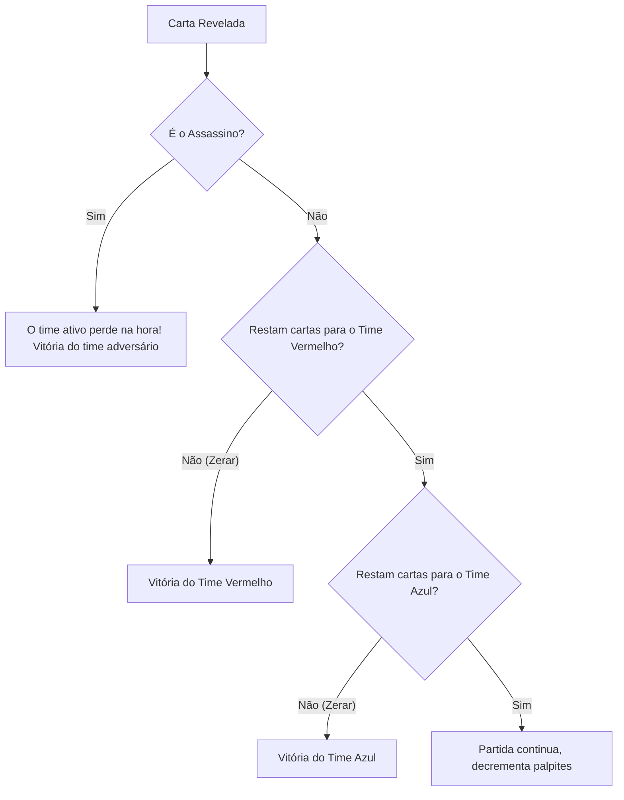

# Condições de Vitória e Fim de Jogo

## 1. Objetivo
Esclarecer os critérios que determinam o encerramento de uma partida, definindo o time vencedor e o motivo do término.

---

## 2. Conceitos
* **Cards Victory**: Condição em que uma equipe revela com sucesso todas as suas palavras secretas associadas.
* **Assassin Defeat (Derrota pelo Assassino)**: Condição em que uma equipe revela a carta de cor preta (assassino), resultando em derrota instantânea da equipe ativa.

---

## 3. Funcionamento
A verificação de fim de jogo ocorre imediatamente após cada carta ser revelada no reducer (`REVEAL_CARD`). O fluxo avalia as condições na seguinte ordem de prioridade:
1. **Verificar se a carta revelada é o Assassino**: Se sim, a equipe ativa que realizou a ação perde na hora. A vitória é atribuída à equipe rival.
2. **Verificar se alguma equipe zerou suas cartas restantes**: O Host mantém contadores de cartas pendentes (`remainingCards`). Se `remainingCards.red === 0`, o Time Vermelho vence. Se `remainingCards.blue === 0`, o Time Azul vence.

---

## 4. Diagrama de Avaliação de Fim de Jogo



---

## 5. Exemplos

### Verificação lógica do Fim de Jogo (validators.ts)
```typescript
export function isGameOver(state: GameState): { over: boolean; winner: 'red' | 'blue' | null; reason: 'cards' | 'assassin' | null } {
  const assassinRevealed = state.board.find((card) => card.color === 'assassin' && card.revealed);

  if (assassinRevealed) {
    const losingTeam = state.currentTeam;
    const winner = losingTeam === 'red' ? 'blue' : 'red';
    return { over: true, winner, reason: 'assassin' };
  }

  if (state.remainingCards.red === 0) return { over: true, winner: 'red', reason: 'cards' };
  if (state.remainingCards.blue === 0) return { over: true, winner: 'blue', reason: 'cards' };

  return { over: false, winner: null, reason: null };
}
```

---

## 6. Referências
* [Módulo de Validação do Fim de Jogo](file:///home/ikidon/github/krypton/packages/engine/src/validators.ts#L114-L135)
