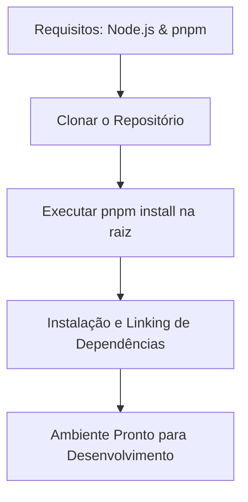

# Instalação

## 1. Objetivo
Esta página detalha os passos necessários para configurar o ambiente de desenvolvimento local, clonar o repositório e preparar todas as dependências do monorepo.

---

## 2. Conceitos
* **pnpm Workspaces**: O pnpm é o gerenciador de pacotes escolhido para gerenciar nosso monorepo devido à sua velocidade e eficiência de armazenamento (através de hard-linking).
* **NVM (Node Version Manager)**: Recomendado para gerenciar múltiplas versões do Node.js.

---

## 3. Funcionamento
A instalação é centralizada na raiz do monorepo. O comando `pnpm install` realiza o download de todas as dependências de todos os subpacotes (tanto aplicativos quanto bibliotecas locais) e estabelece os links simbólicos necessários entre eles.

---

## 4. Diagrama de Fluxo de Configuração



---

## 5. Exemplos

### Verificar Requisitos
```bash
node -v  # Deve retornar >= v20
pnpm -v  # Deve retornar >= v9
```

### Clonar o Repositório
```bash
git clone https://github.com/ikidoncc/krypton.git
cd krypton
```

### Instalar Dependências
```bash
pnpm install
```

---

## 6. Referências
* [Site oficial do pnpm](https://pnpm.io)
* [Instalação do Node.js](https://nodejs.org)
