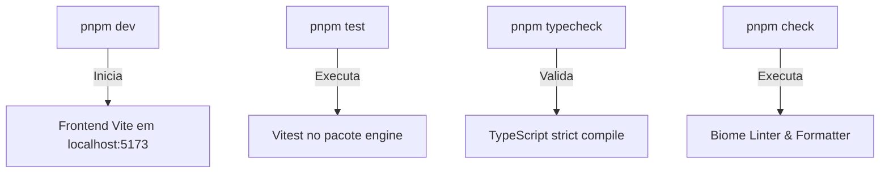

# Rodando Localmente

## 1. Objetivo
Guiar o desenvolvedor sobre como iniciar os servidores locais de desenvolvimento, rodar testes de unidade e executar ferramentas de validação (como typechecking e formatação/linting com Biome).

---

## 2. Conceitos
* **Vite Dev Server**: Servidor rápido com carregamento dinâmico (HMR) utilizado pelo frontend do jogo.
* **Vitest**: Executor de testes integrado que roda testes lógicos da engine em tempo recorde.
* **Biome Check**: Ferramenta consolidada que unifica linting, formatação e organização de imports.

---

## 3. Funcionamento
Todos os comandos relevantes são definidos no `package.json` na raiz do monorepo e são propagados ou direcionados para pacotes específicos através de filtros do `pnpm`.

---

## 4. Diagrama de Comandos e Fluxo



---

## 5. Exemplos

### Executar em Desenvolvimento
Para iniciar a aplicação React do jogo em desenvolvimento local:
```bash
pnpm dev
```
Acesse [http://localhost:5173](http://localhost:5173).

### Executar Testes
Para rodar a suite de testes unitários da engine lógicos:
```bash
pnpm test
```

### Validações de Qualidade de Código
```bash
# Executa typecheck strict em todo o workspace
pnpm typecheck

# Verifica e formata arquivos usando o Biome
pnpm check
```

---

## 6. Referências
* [Guia de CLI do Vite](https://vite.dev/guide/cli)
* [Documentação do Vitest](https://vitest.dev)
* [Biome CLI Docs](https://biomejs.dev/reference/cli/)
