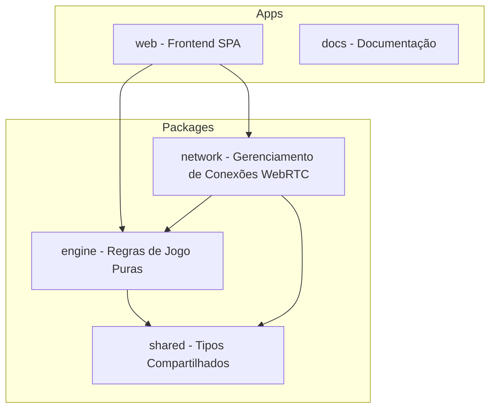

# Introdução ao Krypton

Bem-vindo à documentação oficial do **Krypton**, um jogo multiplayer de dedução de palavras em tempo real com conexão ponto a ponto (P2P) autoritativa via WebRTC, livre de dependências de backend ou servidores dedicados.

---

## 🎯 Objetivo

O principal objetivo do Krypton é validar uma experiência de jogo cooperativa e competitiva robusta, de latência ultrabaixa e com custo de infraestrutura zero. A aplicação utiliza o modelo **Host-Authoritative P2P**, assegurando a integridade e conformidade das regras sem expor informações confidenciais a jogadores não autorizados.

---

## 💡 Conceitos Chave

* **Monorepo**: Centralização do ecossistema de pacotes compartilhados e aplicações sob o mesmo repositório com `pnpm workspaces`.
* **Host-Authoritative**: O jogador que inicia a sala passa a atuar como o servidor lógico da partida (Host). Todas as jogadas dos clientes são intenções enviadas via rede e validadas pelo Host.
* **State Masking**: Proteção de dados confidenciais (ex: cores de cartas ocultas) enviados aos clientes.

---

## 🛠️ Tecnologias Utilizadas

O ecossistema Krypton é construído com as seguintes tecnologias principais:

* **React**: Biblioteca para renderização declarativa e ágil de componentes e estados visuais.
* **TypeScript**: Tipagem estática rigorosa para prevenir falhas de comunicação em tempo de execução.
* **Tailwind CSS v4 & shadcn/ui**: Estilização moderna otimizada e sistema de design unificado.
* **Zustand**: Gerenciamento de estado levíssimo integrado com reatividade à rede P2P.
* **WebRTC & PeerJS**: Comunicação e troca de dados direta e segura entre navegadores.

---

## 🗺️ Diagrama de Visão Geral

O diagrama a seguir exibe a interconexão estrutural dos elementos do monorepo:

---

## ⚡ Atalhos Rápidos

Escolha um dos tópicos abaixo para explorar os detalhes da documentação:

:::info CARDS DE NAVEGAÇÃO RÁPIDA

* 💻 **[Instalação](/getting-started/installation)**: Aprenda a preparar o ambiente local e clonar o repositório.
* 📐 **[Arquitetura](/architecture/overview)**: Conheça a distribuição do monorepo e o funcionamento P2P autoritativo.
* ⚙️ **[Engine de Jogo](/engine/gamestate)**: Entenda as regras lógicas, validações de turnos e geração do tabuleiro.
* ☁️ **[Deploy Independente](/deploy)**: Instruções passo a passo para deploy no Cloudflare Pages.
* 🤝 **[Contribuição](/contribution)**: Guia completo sobre o Git Flow do projeto e formatação do código.

:::

---

## 📚 Referências

* [Documentação do Docusaurus](https://docusaurus.io)
* [Repositório do Projeto no GitHub](https://github.com/ikidoncc/krypton)
