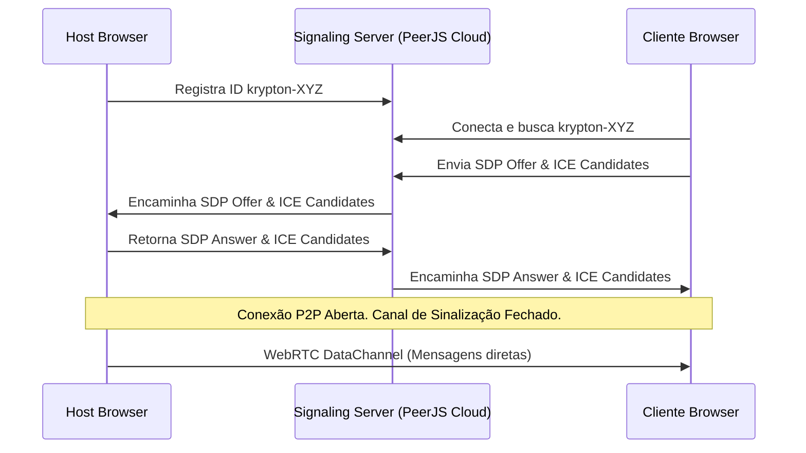

# Servidor de Sinalização (Signaling)

## 1. Objetivo
Esclarecer o papel do servidor de sinalização no ecossistema WebRTC do Krypton, comprovando que ele não atua no fluxo das partidas nem armazena dados de jogo.

---

## 2. Conceitos
* **Signaling**: O processo de troca de informações de rede e mídia entre dois dispositivos para estabelecer uma conexão direta P2P.
* **ICE (Interactive Connectivity Establishment)**: Protocolo usado para encontrar caminhos de comunicação direta entre dois browsers (atravesando NATs e Firewalls).
* **SDP (Session Description Protocol)**: Protocolo que define as configurações de conexão (como codecs e criptografia).

---

## 3. Funcionamento
O servidor de sinalização atua exclusivamente na fase de **Descoberta inicial**:
1. O Host se registra informando que está escutando no endereço `krypton-{ROOM_CODE}`.
2. O Cliente envia um pedido de handshake para `krypton-{ROOM_CODE}` através do servidor de sinalização.
3. O servidor de sinalização apenas **encaminha** a Oferta (Offer) do cliente para o Host, a Resposta (Answer) do Host para o cliente e os candidatos ICE de ambos.
4. Assim que a conexão WebRTC direta (P2P) é estabelecida, a comunicação passa a ocorrer diretamente entre os browsers. O servidor de sinalização deixa de participar de todo o restante da partida.

---

## 4. Diagrama de Transmissão de Sinalização



---

## 5. Exemplos

### Configuração do PeerJS (peer.ts)
A conexão com o servidor de sinalização gratuito do PeerJS Cloud é configurada da seguinte forma na nossa fábrica de peers:
```typescript
import { Peer } from 'peerjs';

export function createPeer(id?: string): Promise<Peer> {
  return new Promise((resolve, reject) => {
    const peer = id ? new Peer(id) : new Peer();
    peer.once('open', () => resolve(peer));
    peer.once('error', (err) => reject(err));
  });
}
```

---

## 6. Referências
* [MDN: Signaling and Video Calling](https://developer.mozilla.org/en-US/docs/Web/API/WebRTC_API/Signaling_and_video_calling)
* [PeerJS Server Code on GitHub](https://github.com/peers/peerjs-server)
