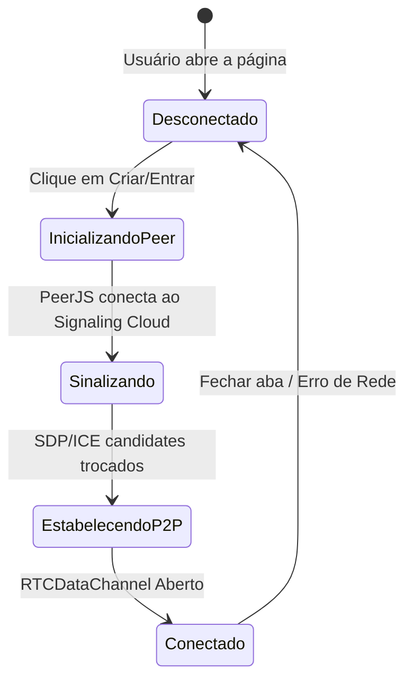

# WebRTC e Canal de Dados (DataChannel)

## 1. Objetivo
Explicar a implementação técnica da comunicação direta entre navegadores através de canais de dados (DataChannels) do WebRTC, detalhando o ciclo de conexão e gerenciamento de falhas.

---

## 2. Conceitos
* **RTCPeerConnection**: A API fundamental do navegador para gerenciar a conexão WebRTC direta.
* **RTCDataChannel**: Canal de dados bi-direcional aberto dentro da conexão RTCPeerConnection, utilizado para transmitir payloads binários ou strings de texto.
* **Reliable Connection**: Configuração do canal de dados para garantir a entrega ordenada de pacotes (`reliable: true`), essencial para replicação consistente de estados.

---

## 3. Funcionamento
O Krypton encapsula as conexões WebRTC individuais através da biblioteca **PeerJS**:
1. O Host cria um PeerJS peer que escuta conexões no ID público `krypton-{ROOM_CODE}`.
2. O Cliente abre seu próprio PeerJS peer com ID randômico e inicia a chamada `peer.connect(hostId)`.
3. Os navegadores realizam o handshake WebRTC via servidor de sinalização.
4. O canal de dados é estabelecido e as mensagens JSON são enviadas e recebidas de forma reativa.
5. Se uma conexão cair, o `HostManager` detecta o evento de `close` no canal e remove o jogador da partida.

---

## 4. Diagrama de Ciclo de Vida da Conexão



---

## 5. Exemplos

### Configuração do Peer e Escuta de Dados (clientManager.ts)
```typescript
private setupConnectionListeners(): void {
  this.hostConn.on('data', (raw) => {
    const msg = parseMessage(raw);
    if (msg) this.handleMessage(msg);
  });

  this.hostConn.on('close', () => {
    this.emit('disconnected', undefined);
  });
}
```

---

## 6. Referências
* [MDN: RTCDataChannel Interface](https://developer.mozilla.org/en-US/docs/Web/API/RTCDataChannel)
* [PeerJS API Documentation](https://peerjs.com/docs/)
