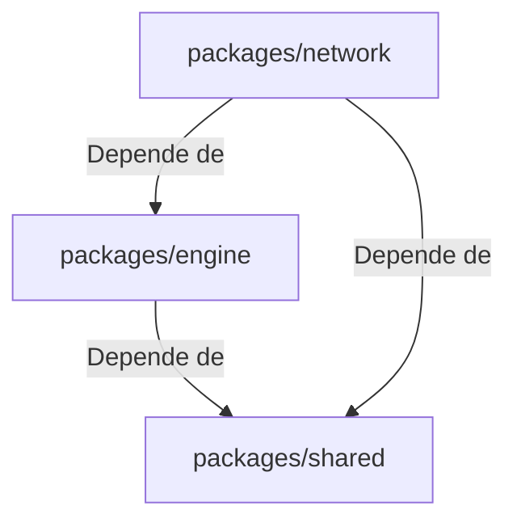

# Pacotes (Packages) do Monorepo

## 1. Objetivo
Descrever as responsabilidades lógicas, dependências e contextos de utilização de cada pacote interno do monorepo.

---

## 2. Conceitos
* **Encapsulamento de Pacotes**: Cada biblioteca sob `packages/` representa uma camada isolada de complexidade que pode ser importada e reaproveitada em múltiplos aplicativos.
* **TSConfig References**: Project references do TypeScript compilam dependências na ordem hierárquica correta.

---

## 3. Funcionamento e Dependências

As bibliotecas internas cooperam da seguinte forma:



---

## 4. Detalhamento dos Pacotes

### `@krypton/shared`
* **Responsabilidade**: Tipagem TypeScript estrita, definições lógicas centrais e envelopes de mensagens serializadas.
* **Dependências**: Nenhuma (zero-dependency).
* **Quando utilizar**: Deve ser importado por todos os aplicativos e pacotes para manter a conformidade de dados lúdicos.

### `@krypton/engine`
* **Responsabilidade**: Motor de regras puras do jogo, contendo o embaralhador de tabuleiro, validação de turnos, dicionário de palavras e reducer de transições de estado.
* **Dependências**: `@krypton/shared`.
* **Quando utilizar**: Em qualquer ambiente que processe a lógica de Codenames (no Host local ou em um futuro servidor Node.js/Cloudflare Workers).

### `@krypton/network`
* **Responsabilidade**: Camada de rede WebRTC. Abstrai a criação de salas PeerJS, gerencia conexões ativas, atua como intermediário de roteamento e executa o mascaramento de dados (state masking) do tabuleiro.
* **Dependências**: `@krypton/shared`, `@krypton/engine`, `peerjs`.
* **Quando utilizar**: Onde houver necessidade de comunicação de rede ponto a ponto ou sincronização de estados.

---

## 5. Exemplos

### Declaração de Importação no Mapeamento do Monorepo
Exemplo de declaração de dependência local no `apps/web/package.json`:
```json
"dependencies": {
  "@krypton/shared": "workspace:*",
  "@krypton/engine": "workspace:*",
  "@krypton/network": "workspace:*"
}
```

---

## 6. Referências
* [Código Fonte do shared](file:///home/ikidon/github/krypton/packages/shared)
* [Código Fonte do engine](file:///home/ikidon/github/krypton/packages/engine)
* [Código Fonte do network](file:///home/ikidon/github/krypton/packages/network)
