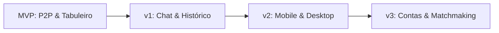

# Roadmap do Projeto

## 1. Objetivo
Esboçar a visão de futuro do projeto Krypton, mapeando as metas a serem alcançadas em cada release do produto.

---

## 2. Conceitos
* **MVP (Minimum Viable Product)**: O estágio atual do jogo focado em validar conexões P2P estáveis no navegador e regras lúdicas corretas.
* **Fases Pós-MVP**: Etapas futuras que adicionam persistência de dados, perfis de usuários e suporte multiplataforma.

---

## 3. Funcionamento do Roadmap
As entregas do Krypton ocorrem em ciclos iterativos incrementais:

---

## 4. Planejamento das Versões

### 🚀 MVP (Atual)
* Criação de sala e geração de códigos de convite legíveis.
* Rede P2P autoritativa via WebRTC com PeerJS Cloud.
* Divisão de equipes e validação de papéis mínimos.
* Grid do tabuleiro 5×5 com sorteio e embaralhamento do pool de 400 palavras.
* Mascaramento automático do tabuleiro (State Masking) para evitar trapaças.
* Fluxo de reinício rápido ("Jogar Novamente") mantendo o lobby ativo.

### 📅 Versão 1 (Curto Prazo)
* **Chat Interno**: Comunicação integrada por texto durante o lobby.
* **Histórico de Partidas**: Histórico das últimas jogadas armazenado localmente.
* **Reconexão Resiliente**: Retomada de sessão P2P caso o jogador caia temporariamente.

### 📱 Versão 2 (Médio Prazo)
* **Mobile Wrappers**: Adaptação do frontend React para rodar nativamente via Capacitor/Cordova.
* **Desktop App**: Versão instalável via Electron ou Tauri.

### 👥 Versão 3 (Longo Prazo)
* **Contas de Usuário**: Criação de cadastro e estatísticas acumuladas.
* **Ranking & Matchmaking**: Sistema de busca de partidas públicas e pareamento de níveis.

---

## 5. Referências
* [Visualizar requisitos do MVP](file:///home/ikidon/github/krypton/mvp.md)
