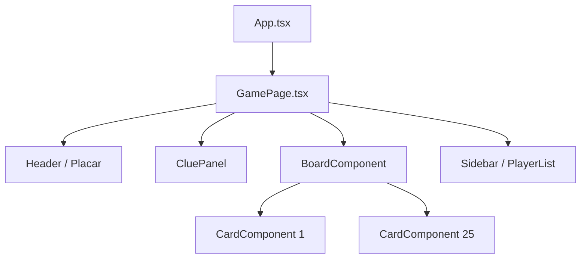

# Componentes Visuais

## 1. Objetivo
Mapear e documentar os principais componentes visuais em React do projeto, suas propriedades e responsabilidades de renderização de interface.

---

## 2. Conceitos
* **Componentes Puros de Renderização**: Componentes que recebem dados via propriedades (`props`) e emitem ações de callback, mantendo-se livres de lógica de rede ou de estado mutável direto.
* **Acessibilidade Semântica**: Uso correto de elementos HTML (como `<button>` e inputs associados a `<label>`) para garantir suporte a leitores de tela e navegação por teclado.

---

## 3. Funcionamento
A interface do Krypton baseia-se em um conjunto de componentes organizados:
* **BoardComponent**: Recebe o tabuleiro linear de 25 elementos e renderiza um grid css 5x5, repassando permissões de clique individuais para cada carta.
* **CardComponent**: Componente com animação de flip 3D. Renderiza a frente (palavra + pistas visuais de cores para Mestres) e as costas (cor sólida revelada + ícones).
* **CluePanel**: Painel dinâmico que exibe os inputs de texto e quantidade para Mestres no turno de dar dicas, ou a pista ativa e tentativas restantes para Operativos no turno de adivinhações.
* **PlayerList**: Lista os jogadores ativos agrupando-os por equipe (Vermelho, Azul ou Espectadores), com destaque para o Host e jogador local.

---

## 4. Diagrama de Hierarquia de Componentes (Fase Playing)



---

## 5. Exemplos

### Interface do CardComponent (CardComponent.tsx)
```typescript
interface CardComponentProps {
  card: Card;
  isSpymaster: boolean;
  isCurrentTeamOperative: boolean;
  onClick?: (cardId: number) => void;
}
```

---

## 6. Referências
* [Código do CardComponent](file:///home/ikidon/github/krypton/apps/web/src/components/board/CardComponent.tsx)
* [Código do BoardComponent](file:///home/ikidon/github/krypton/apps/web/src/components/board/BoardComponent.tsx)
* [Código do CluePanel](file:///home/ikidon/github/krypton/apps/web/src/components/turns/CluePanel.tsx)
